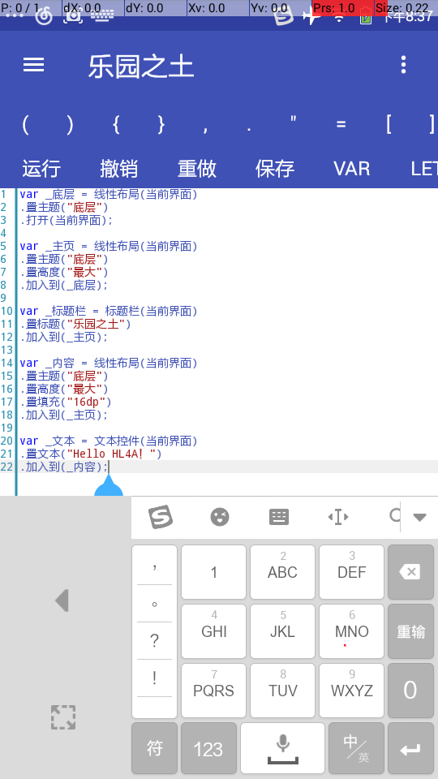

# 乐园之土
使用js,lua,bsh编写Android应用
 
 [码云](https://gitee.com/MikaGuraN/HL4A)
 [Github](https://github.com/MikaGuraN/HL4A)
 
 [预览版](./乐园之土.apk)<pre>

还在不断完善啦

欢迎加入讨论群：538982726

更新日志:

1.5.5

完善了UI选择器
加入网络文件机制
JS错误显示函数调用关系

1.5.4

辅助服务:UI选择器
和一些辅助服务方法
辅助了脚本界面的一个错误

1.5.3

更新xml和json的工具类
更多...
和一个未完成的NK插件(?)

1.5.0

修复错误
完善网络操作
JS加入中文关键字
更多......

1.4.10/11

测试版本

1.4.9

一个简单IDE
各种优化

1.4.9

优化了代码框
修复申请权限

1.4.8

加入MD下拉刷新视图
加入6.0权限检测系统
(使用了V4包)

1.4.7

IDE加入格式化，编码，解码

1.4.6

优化JS反射和DEX加载
更改文本单位dp到sp
(dp可能导致不同手机相对过大或过小)

1.4.5

优化JS，删去无用代码

1.4.4

修复一处文件小错误

1.4.3

修复代码框指针透明

1.4.2

优化简单IDE
优化代码框
增加错误显示界面

1.4.1

优化简单IDE
视图加入置权重
和布局重力方法
优化代码框和其他

1.4.0

修复大量视图上的BUG
加入代码框控件
增加MD弹窗(完美)
增加高级弹出菜单
做了一个简单IDE！

1.3.19

加入了基本所有常用控件
优化布局和控件操作

1.3.18

更新了一点点文档(？)

1.3.17

增加一些基本控件

1.3.16

完善辅助服务

1.3.15

修改JS抛出错误使更详细
各种优化

1.3.14

完善反射功能
新增网络操作
完善脚本操作
修复其他问题

1.3.13

优化Lua导入类等
汉化一些Lua报错
添加一个Lua实例
加入jsoup支持(测试版未编译进)

1.3.12

优化压缩解压

1.3.11

HL-JS改名HL4A
加入lua,bsh支持
全面优化中

1.3.10

优化Service

1.3.9

重构包名、结构
精简无用代码
修复可能导致的错误

1.3.8

完善辅助服务，加入检测

1.3.7

完善了Service功能
新增一系列辅助功能
更新了集合功能

1.3.6

增加界面对EventBus的支持
完善了线程,任务和界面 
增加了对Properties和XML的支持 

1.3.5 

增加 取全部应用，取用户应用及取系统应用 

1.3.4 

新增集合，哈希表，JS对象序列化 
和反序列化还原的功能 

修复了时不时白屏的问题。 

更改直接从安装包读取文件为启动时解压APK所有文件。 

</pre>
 
  协议 :
 [GNU GENERAL PUBLIC LICENSE 3](./LICENSE)
